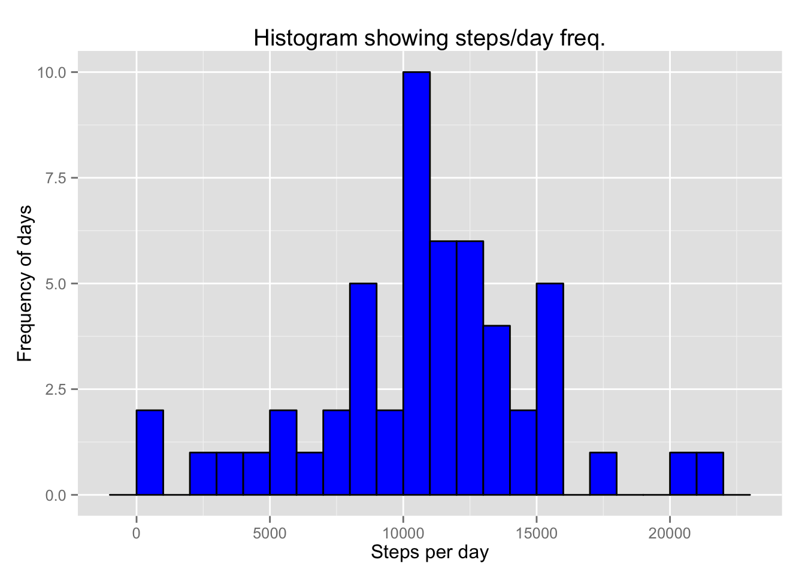
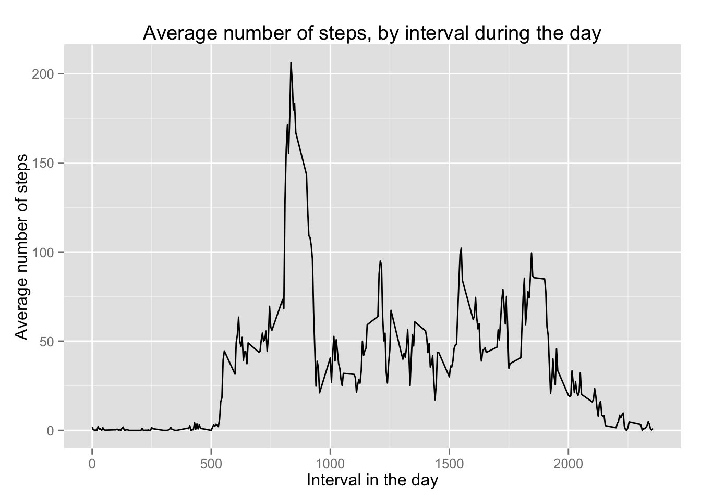

# Reproducible Research: Peer Assessment 1


## Loading and preprocessing the data


```r
data <- read.csv("activity.csv")
```

## What is mean total number of steps taken per day?

First, compute the total number of steps per day, excluding missing values

```r
library(ggplot2)
```

```
## Warning: package 'ggplot2' was built under R version 3.1.3
```


```r
raw.data <- read.csv("activity.csv")

data <- raw.data[!is.na(raw.data$steps),]

steps.by.date <- aggregate(steps ~ date, data = data, FUN = sum)
```

A histogram of the steps per day shows the distribution:


```r
p <- ggplot(steps.by.date, aes(x=steps)) +  geom_histogram(binwidth = 1000, fill="blue")  + 
  labs(title = "Histogram showing steps per day frequencies", 
       x = "Steps per day",
       y = "Frequency of occurrence")

print(p)
```

 

### Mean and median steps taken per day

The mean number of steps taken per day is 10766.19.

The median number of steps taken per day is 10765

## What is the average daily activity pattern?


```r
average.steps <- aggregate(steps ~ interval, data = data, FUN = mean)

p <- ggplot(average.steps, aes(x = interval, y = steps)) + 
  geom_line() +
  labs(title = "Average number of steps, by interval during the day", 
       x = "Interval in the day", y = "Average number of steps")

print(p)
```

 

The interval with the maximum average number of steps is calculated by:

```r
average.steps.max <- average.steps[which.max(average.steps$steps),]
max.interval <- average.steps.max$interval

# compute values for showing the time of day when the max interval occurred
# Intervals are hours * 100 + minutes
max.interval.hour <- floor(max.interval/100)
max.interval.min <- max.interval %% 100
max.interval.time <- sprintf("%d:%02d %s", max.interval.hour, 
  max.interval.min, if(max.interval.hour >= 12) "pm" else "am")
```

And its value is 835, or 8:35 am.

## Imputing missing values

The data set contains many rows with missing values for the number of steps.  The following code calculates and shows just how many rows have missing step information:


```r
print(sum(is.na(raw.data$steps)))
```

```
## [1] 2304
```

These missing step values may skew the actual averages ....????

One approach to correct the missing value situation is to devise a means of coming up with representative numbers of steps by interval, using the average numbers of steps per interval computed over the rest of the dataset.


## Are there differences in activity patterns between weekdays and weekends?
